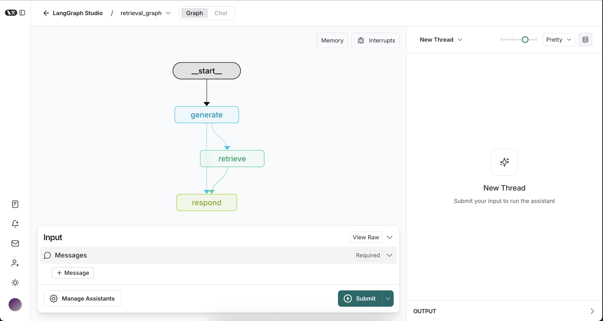

# Agentic-Rag-LangGraph

This is a starter project to help you get started with developing a retrieval agent using [LangGraph](https://github.com/langchain-ai/langgraph) in [LangGraph Studio](https://github.com/langchain-ai/langgraph-studio).



It contains example graphs exported from `src/retrieval_agent/graph.py` that implement a retrieval-based question answering system.

## Getting Started

Assuming you have already [installed LangGraph Studio](https://github.com/langchain-ai/langgraph-studio?tab=readme-ov-file#download), to set up:

1. Create a `.env` file.

```bash
cp .env.example .env
```

2. Select your retriever & index, and save the access instructions to your `.env` file.

<!--
Setup instruction auto-generated by `langgraph template lock`. DO NOT EDIT MANUALLY.
-->

### Setup Retriever

The defaults values for `retriever_provider` are shown below:

```yaml
retriever_provider: elastic
```

Follow the instructions below to get set up, or pick one of the additional options.

#### Elasticsearch

Elasticsearch (as provided by Elastic) is an open source distributed search and analytics engine, scalable data store and vector database optimized for speed and relevance on production-scale workloads.

##### Setup Elasticsearch
Elasticsearch can be configured as the knowledge base provider for a retrieval agent by being deployed on Elastic Cloud (either as a hosted deployment or serverless project) or on your local environment.

**Local Elasticsearch (Docker)**

```
docker run -p 127.0.0.1:9200:9200 -d --name elasticsearch --network elastic-net   -e ELASTIC_PASSWORD=changeme   -e "discovery.type=single-node"   -e "xpack.security.http.ssl.enabled=false"   -e "xpack.license.self_generated.type=trial"   docker.elastic.co/elasticsearch/elasticsearch:8.15.1
```

See the [official Elastic documentation](https://www.elastic.co/guide/en/elasticsearch/reference/current/run-elasticsearch-locally.html) for more information on running it locally.

Then populate the following in your `.env` file:

```
# As both Elasticsearch and LangGraph Studio runs in Docker, we need to use host.docker.internal to access.

ELASTICSEARCH_URL=http://host.docker.internal:9200
ELASTICSEARCH_USER=elastic
ELASTICSEARCH_PASSWORD=changeme
```


### Setup Model

The defaults values for `response_model`, `query_model` are shown below:

```yaml
response_model: anthropic/claude-3-5-sonnet-20240620
query_model: anthropic/claude-3-haiku-20240307
```

Follow the instructions below to get set up, or pick one of the additional options.

#### OpenAI

To use OpenAI's chat models:

1. Sign up for an [OpenAI API key](https://platform.openai.com/signup).
2. Once you have your API key, add it to your `.env` file:
```
OPENAI_API_KEY=your-api-key
```

### Setup Embedding Model

The defaults values for `embedding_model` are shown below:

```yaml
embedding_model: openai/text-embedding-3-small
```

Follow the instructions below to get set up, or pick one of the additional options.

#### OpenAI

To use OpenAI's embeddings:

1. Sign up for an [OpenAI API key](https://platform.openai.com/signup).
2. Once you have your API key, add it to your `.env` file:
```
OPENAI_API_KEY=your-api-key
```
#### Ollama

To use Ollama's chat models:

1. Fill in the `OLLAMA_HOST` in your `.env` file:
```
OLLAMA_HOST=http://host.docker.internal:11434
```
2. Fill in the `EMBEDDING_MODEL` in your `.env` file:
```
EMBEDDING_MODEL=ollama/bge-m3 
```
3. Fill in the `RESPONSE_MODEL` in your `.env` file:
```
RESPONSE_MODEL=ollama/llama3.1:8b
```
4. Fill in the `QUERY_MODEL` in your `.env` file:
```
QUERY_MODEL=ollama/llama3.1:8b
```

<!--
End setup instructions
-->

## Using

When you upload content, it will be indexed under the configured user ID. You know it's complete when the indexer "delete"'s the content from its graph memory (since it's been persisted in your configured storage provider).

Next, open the "retrieval_graph" using the dropdown in the top-left. Ask it about your cat to confirm it can fetch the required information! If you change the `user_id` at any time, notice how it no longer has access to your information. The graph is doing simple filtering of content so you only access the information under the provided ID.

## How to customize

You can customize this retrieval agent template in several ways:

1. **Change the retriever**: You can switch between different vector stores (Elasticsearch, MongoDB, Pinecone) by modifying the `retriever_provider` in the configuration. Each provider has its own setup instructions in the "Getting Started" section above.

2. **Modify the embedding model**: You can change the embedding model used for document indexing and query embedding by updating the `embedding_model` in the configuration. Options include various OpenAI and Cohere models.

3. **Adjust search parameters**: Fine-tune the retrieval process by modifying the `search_kwargs` in the configuration. This allows you to control aspects like the number of documents retrieved or similarity thresholds.

4. **Customize the response generation**: You can modify the `response_system_prompt` to change how the agent formulates its responses. This allows you to adjust the agent's personality or add specific instructions for answer generation.

5. **Change the language model**: Update the `response_model` in the configuration to use different language models for response generation. Options include various Claude models from Anthropic, as well as models from other providers like Fireworks AI.

6. **Extend the graph**: You can add new nodes or modify existing ones in the `src/retrieval_agent/graph.py` file to introduce additional processing steps or decision points in the agent's workflow.

7. **Add new tools**: Implement new tools or API integrations in `src/retrieval_agent/tools.py` to expand the agent's capabilities beyond simple retrieval and response generation.

8. **Modify prompts**: Update the prompts used for query generation and response formulation in `src/retrieval_agent/prompts.py` to better suit your specific use case or to improve the agent's performance.

Remember to test your changes thoroughly to ensure they improve the agent's performance for your specific use case.

## Development

While iterating on your graph, you can edit past state and rerun your app from past states to debug specific nodes. Local changes will be automatically applied via hot reload. Try adding an interrupt before the agent calls tools, updating the default system message in `src/retrieval_agent/utils.py` to take on a persona, or adding additional nodes and edges!

Follow up requests will be appended to the same thread. You can create an entirely new thread, clearing previous history, using the `+` button in the top right.

You can find the latest (under construction) docs on [LangGraph](https://github.com/langchain-ai/langgraph) here, including examples and other references. Using those guides can help you pick the right patterns to adapt here for your use case.

LangGraph Studio also integrates with [LangSmith](https://smith.langchain.com/) for more in-depth tracing and collaboration with teammates.

